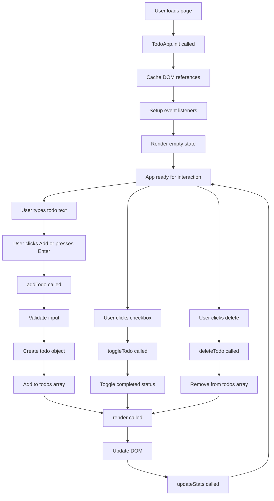

# Todo App Implementation Plan

## Project Overview
A simple, minimal Todo application built with HTML, CSS, and vanilla JavaScript featuring:
- Add new todos
- Mark todos as complete/incomplete
- Delete todos
- Clean, minimal design
- No data persistence (in-memory only)

---

## 1. File Structure

```
todo-app/
├── index.html          # Main HTML file with app structure
├── styles.css          # CSS styling for minimal, clean design
└── app.js              # JavaScript with TodoApp class and logic
```

**Rationale:**
- Simple 3-file structure keeps the project organized and easy to navigate
- Separation of concerns: structure (HTML), presentation (CSS), behavior (JS)
- All files in root directory for simplicity

---

## 2. HTML Layout Structure

### Main Components

```
<!DOCTYPE html>
<html>
  <head>
    - Meta tags (charset, viewport)
    - Title
    - Link to styles.css
  </head>
  <body>
    <div class="container">
      <header>
        <h1>My Todo List</h1>
      </header>
      
      <div class="todo-input-section">
        <input type="text" id="todoInput" placeholder="Add a new todo...">
        <button id="addBtn">Add</button>
      </div>
      
      <div class="todo-stats">
        <span id="totalCount">Total: 0</span>
        <span id="completedCount">Completed: 0</span>
      </div>
      
      <ul id="todoList" class="todo-list">
        <!-- Todo items will be dynamically inserted here -->
      </ul>
    </div>
    
    <script src="app.js"></script>
  </body>
</html>
```

### Todo Item Structure (Dynamic)
Each todo item will be created dynamically with this structure:
```html
<li class="todo-item" data-id="unique-id">
  <input type="checkbox" class="todo-checkbox">
  <span class="todo-text">Todo text here</span>
  <button class="delete-btn">Delete</button>
</li>
```

**Key Elements:**
- `container`: Main wrapper for centering and max-width
- `todo-input-section`: Input field and add button
- `todo-stats`: Display total and completed count
- `todoList`: Unordered list to hold all todo items
- Each todo item has: checkbox, text span, and delete button

---

## 3. TodoApp Class State

The TodoApp class needs to track the following state:

```javascript
class TodoApp {
  constructor() {
    this.todos = [];           // Array of todo objects
    this.nextId = 1;           // Counter for generating unique IDs
    this.todoInput = null;     // Reference to input element
    this.addBtn = null;        // Reference to add button
    this.todoList = null;      // Reference to todo list container
    this.totalCount = null;    // Reference to total count display
    this.completedCount = null; // Reference to completed count display
  }
}
```

### Todo Object Structure
Each todo in the `todos` array will be an object:
```javascript
{
  id: 1,                    // Unique identifier (number)
  text: "Buy groceries",    // Todo text content (string)
  completed: false          // Completion status (boolean)
}
```

**State Properties Explained:**
- `todos`: Core data structure holding all todo items
- `nextId`: Ensures each todo gets a unique ID for tracking
- DOM element references: Cached for performance (avoid repeated DOM queries)

---

## 4. TodoApp Class Methods

### Core Methods

#### `init()`
- **Purpose**: Initialize the app when DOM is loaded
- **Actions**:
  - Cache DOM element references
  - Set up event listeners
  - Render initial empty state

#### `addTodo(text)`
- **Purpose**: Create and add a new todo
- **Parameters**: `text` (string) - The todo text
- **Actions**:
  - Validate text is not empty
  - Create todo object with unique ID
  - Add to `todos` array
  - Increment `nextId`
  - Call `render()` to update UI
  - Clear input field

#### `toggleTodo(id)`
- **Purpose**: Toggle completion status of a todo
- **Parameters**: `id` (number) - The todo's unique ID
- **Actions**:
  - Find todo by ID in `todos` array
  - Toggle its `completed` property
  - Call `render()` to update UI

#### `deleteTodo(id)`
- **Purpose**: Remove a todo from the list
- **Parameters**: `id` (number) - The todo's unique ID
- **Actions**:
  - Filter out todo with matching ID from `todos` array
  - Call `render()` to update UI

#### `render()`
- **Purpose**: Update the DOM to reflect current state
- **Actions**:
  - Clear existing todo list HTML
  - Loop through `todos` array
  - Create DOM elements for each todo
  - Apply appropriate classes (completed/incomplete)
  - Attach event listeners to checkboxes and delete buttons
  - Update statistics (total and completed counts)

#### `updateStats()`
- **Purpose**: Update the statistics display
- **Actions**:
  - Calculate total todos count
  - Calculate completed todos count
  - Update DOM text content for both counters

### Helper Methods

#### `setupEventListeners()`
- **Purpose**: Attach event listeners to static elements
- **Actions**:
  - Add click listener to add button
  - Add keypress listener to input (Enter key)

#### `createTodoElement(todo)`
- **Purpose**: Create DOM element for a single todo
- **Parameters**: `todo` (object) - Todo data object
- **Returns**: DOM element (li)
- **Actions**:
  - Create list item with appropriate classes
  - Set data-id attribute
  - Create and append checkbox, text span, delete button
  - Return the complete element

---

## 5. CSS Design Guidelines

### Minimal and Clean Design Principles
- **Color Palette**: 
  - Background: Light gray or white (#f5f5f5, #ffffff)
  - Primary: Soft blue or gray (#4a90e2, #333333)
  - Success: Light green for completed (#4caf50)
  - Danger: Light red for delete (#f44336)
  
- **Typography**:
  - Sans-serif font family (Arial, Helvetica, or system fonts)
  - Clear hierarchy with font sizes
  - Adequate line height for readability

- **Layout**:
  - Centered container with max-width (600px)
  - Generous padding and margins
  - Clean borders and subtle shadows
  - Responsive design for mobile devices

- **Interactive Elements**:
  - Hover effects on buttons
  - Smooth transitions
  - Clear visual feedback for completed todos (strikethrough, opacity)

---

## 6. Implementation Flow



---

## 7. Key Implementation Details

### Event Delegation
- Attach event listeners to dynamically created elements during render
- Each checkbox gets a change event listener
- Each delete button gets a click event listener

### Data Flow
1. User action triggers method call
2. Method updates state (`todos` array)
3. `render()` is called to sync UI with state
4. DOM is updated to reflect new state

### Input Validation
- Trim whitespace from input
- Check for empty strings
- Provide visual feedback if validation fails

### Accessibility Considerations
- Semantic HTML elements
- Proper button and input labels
- Keyboard navigation support (Enter key to add)

---

## 8. Next Steps for Implementation

1. Create [`index.html`](index.html) with the planned structure
2. Create [`styles.css`](styles.css) with minimal, clean styling
3. Create [`app.js`](app.js) with TodoApp class and all methods
4. Test functionality: add, complete, delete todos
5. Refine styling and user experience
6. Test on different screen sizes

---

## Summary

This plan provides a complete blueprint for building a simple, functional Todo app with:
- **3 files**: Clean separation of concerns
- **Class-based architecture**: Organized, maintainable code
- **State management**: Single source of truth in `todos` array
- **Reactive rendering**: UI always reflects current state
- **Minimal design**: Clean, professional appearance

The implementation should be straightforward and result in a fully functional Todo application.